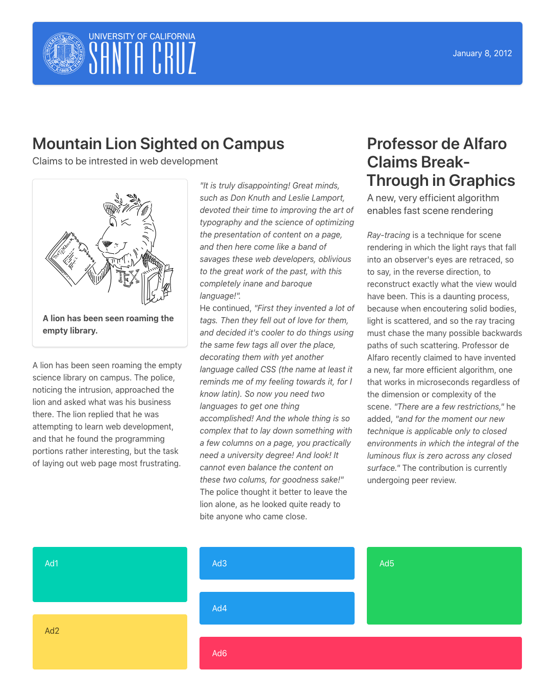

# Homework 1: Create a web page

Please upload the completed assignment on the github repo assigned to you (under assignment1/ as separate files) and and (as a zip) on crowdgrader:

https://peer.crowdgrader.com/crowdgrader/venues/view_venue/5435

Due April 13 by 11:59PM.

## Details

You need to create a web page that looks like the image 

Before doing the homework, you should study the material in Unit 2.

To do the homework, create a folder in your computer, and put into it the file hw1_starter.html.  You then complete that HTML file. You can also put into the same folder images that are loaded by the page; you can load them e.g. via .  The text and images used in the page are provided in this drive folder.  If you work on the assignment with VSCode, it will do a good job of displaying to you a preview of the page; otherwise, you can load the HTML file with a browser (Open > File).

Once you are done, you compress the folder with zip, and submit the zip file as your solution. 
To do the homework, use the Bulma CSS Framework.  You do not need to include Bulma in your submission: the starter file already loads Bulma from a CDN (Content Delivery Network).  Please do not add custom CSS to the solution; do the entire work using only the standard Bulma classes, without adding your own .css file or your own inline css. 

Please don't obsess about the details; the goal here is to let you gain experience with laying out pages, not drive you insane with small details.  Try to get something reasonable-looking.  When you do the columns, it's useful for you to use the is-mobile class, to ensure the columns stay side-by-side on narrower screens.  Also, to get the title spanning two columns, it's useful to first divide the whole screen in the left 2/3 and right 1/3.  Once you place the two-column-wide title, you can split the left 2/3 into two equal columns. 
You can work in groups for this assignment, and discuss it with others; turn in your own solution.

## Rubric

| Points | Criterion |
| ------ | --------- |
| 1.0 |	Does the top bar contain the icon, UCSC logo, and date, reasonably well aligned? |
| 1.0 |	Does the mountain lion story span two columns? |
| 1.0 |	Does the professor de Alfaro story span the rightmost column? |
| 1.0 |	Do the boxes at the bottom follow the proper alignment as in example? (Ad1 and Ad2 equal sized, so Ad3 and Ad4, heights of Ad3, Ad4, Ad6 equal, etc.)? |
| 1.0 |	Are the story titles and subtitles properly formatted? |
| 1.0 |	Is the figure properly formatted? |
| 1.0 |	Does the page as a whole look decent? |
| 1.0 |	Was no CSS (just Bulma) used? |
| 2.0 | For reviewing peers' work |
